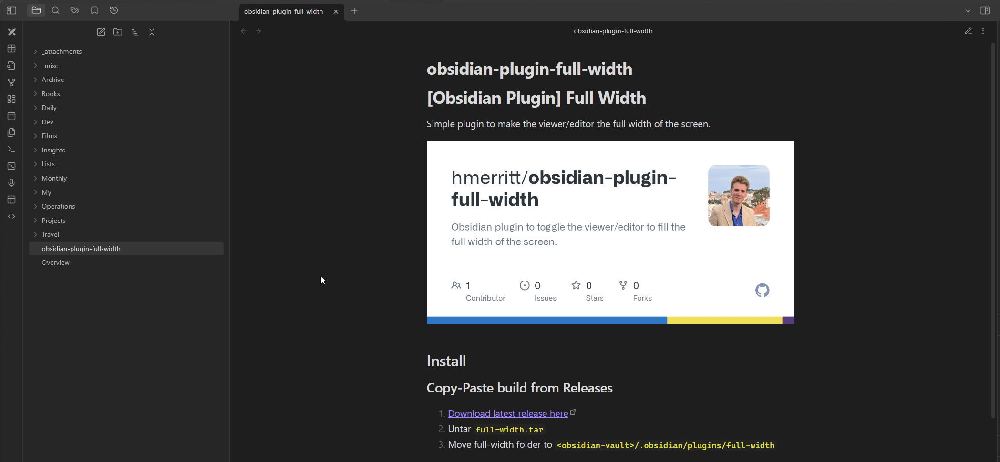

# [Obsidian Plugin] Viewer Full Width

Simple plugin that adds a toggle to expand the viewer to the full width of the screen.

## Install

### Copy-Paste build from Releases

1. [Download latest release here](https://github.com/hmerritt/obsidian-plugin-viewer-full-width/releases/latest)
2. Copy release files into `<obsidian-vault>/.obsidian/plugins/viewer-full-width`

### Build manially

1. Clone repo `git clone https://github.com/hmerritt/obsidian-plugin-viewer-full-width.git`
2. `cd obsidian-plugin-viewer-full-width`
3. `npm i`
4. `npm run build`
5. Copy `main.js` + `manifest.json` into your `<obsidian-vault>/.obsidian/plugins/viewer-full-width`

## Developing

-   Clone repo
-   Make sure your NodeJS is at least v16 (`node --version`)
-   `npm i` to install dependencies.
-   `npm run dev` to start compilation in watch mode.
-   `npm run build` to compile
